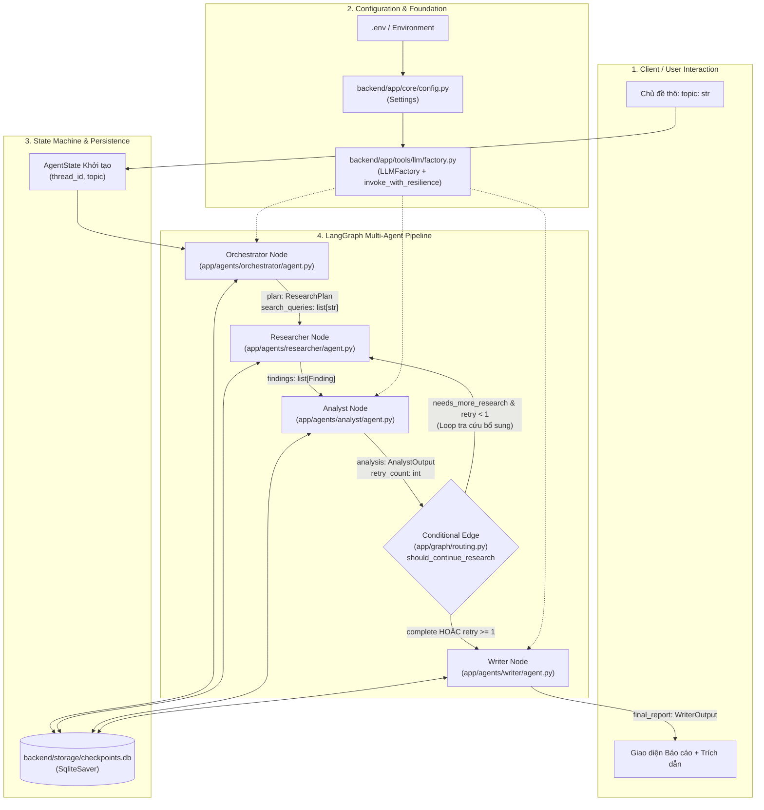

# KIẾN TRÚC LUỒNG DỮ LIỆU TOÀN DIỆN (DATA FLOW ARCHITECTURE)
## Multi-Agent Research System (MAS)

> **Tài liệu:** Đặc tả luồng dữ liệu (Data Flow Specification) cho tất cả các file trong hệ thống  
> **Phiên bản:** 1.0.0 (Production Architecture)  
> **Mục tiêu:** Định nghĩa chi tiết hành trình dữ liệu (Data Lifecycle), sự biến đổi trạng thái (State Transformation), các hợp đồng dữ liệu (Data Contracts), và mối quan hệ Input/Output giữa từng file trong toàn bộ dự án.

---

## 1. TỔNG QUAN HỆ THỐNG & NGUYÊN TẮC LUỒNG DỮ LIỆU

Hệ thống Multi-Agent Research System (MAS) vận hành theo mô hình **Đồ thị Trạng thái Hướng sự kiện (StateGraph-Driven Pipeline)** do LangGraph quản lý.



### 3 Nguyên tắc Luồng Dữ liệu Cốt lõi:
1. **Single Source of Truth (`AgentState`)**: Mọi Agent chỉ đọc dữ liệu từ `AgentState` và chỉ ghi kết quả biến đổi vào `AgentState` dưới dạng partial update. Không có trạng thái toàn cục ẩn (no hidden global mutable state).
2. **Strict Type-Safety & Data Contracts**: 100% dữ liệu luân chuyển giữa các node và file đều tuân thủ chặt chẽ Pydantic v2 schemas (`ResearchPlan`, `Finding`, `AnalystOutput`, `WriterOutput`, `Citation`), không chấp nhận kiểu tự do `Any`.
3. **Deterministic & Bounded State Flow**: Luồng rẽ nhánh và vòng lặp feedback được giới hạn nghiêm ngặt bởi `MAX_RESEARCH_RETRIES = 1` tại `routing.py`, loại trừ hoàn toàn nguy cơ lặp vô hạn (Zero Infinite Loop).

---

## 2. MA TRẬN DỮ LIỆU THEO TỪNG FILE (ALL FILES DATA FLOW MATRIX)

Dưới đây là bảng tổng hợp Input, Transformation và Output cho **toàn bộ các file trong dự án**:

| Đường dẫn File | Phân hệ | Dữ liệu Đầu vào (Inputs) | Quy trình Biến đổi & Logic | Dữ liệu Đầu ra (Outputs) |
| :--- | :--- | :--- | :--- | :--- |
| [`backend/app/core/config.py`](file:///w:/home/nthoang124/Multi-agent-RS-2627/multi-agent-research/backend/app/core/config.py) | Core Config | `.env`, Biến môi trường OS | Nạp, parse kiểu dữ liệu qua `pydantic-settings`, validate API keys, split chuỗi CORS | `Settings` singleton instance (`settings`), `cors_origins: list[str]` |
| [`backend/app/schemas/research.py`](file:///w:/home/nthoang124/Multi-agent-RS-2627/multi-agent-research/backend/app/schemas/research.py) | Data Contracts | Dữ liệu thô từ LLM / Agents | Ràng buộc Pydantic v2 (`min_length=1`, `max_length=5`, `ge=0.0`, `le=1.0`, Literals) | Các Data Classes: `ResearchPlan`, `Finding`, `FollowUpRequest`, `ResearcherOutput`, `AnalystOutput`, `Citation`, `WriterOutput` |
| [`backend/app/graph/state.py`](file:///w:/home/nthoang124/Multi-agent-RS-2627/multi-agent-research/backend/app/graph/state.py) | State Contract | Schemas từ `schemas/research.py` | Định nghĩa khung trạng thái chia sẻ `AgentState(TypedDict)` định kiểu mạnh | Khung dữ liệu chung luân chuyển qua toàn bộ StateGraph |
| [`backend/app/tools/llm/factory.py`](file:///w:/home/nthoang124/Multi-agent-RS-2627/multi-agent-research/backend/app/tools/llm/factory.py) | LLM Tool | `settings.GEMINI_API_KEY`, Prompts, Pydantic Schema | Khởi tạo Gemini 2.0/1.5, áp dụng `with_structured_output`, bọc `tenacity` retry (429, 503) | Đối tượng Pydantic đã validate hoặc `BaseMessage` |
| [`backend/app/agents/orchestrator/prompts.py`](file:///w:/home/nthoang124/Multi-agent-RS-2627/multi-agent-research/backend/app/agents/orchestrator/prompts.py) | Prompts | Không có (Hằng số chuỗi) | Định hình chỉ thị vai trò cho Orchestrator (Phân tách 3-5 truy vấn con đa chiều) | Chuỗi `ORCHESTRATOR_SYSTEM_PROMPT` |
| [`backend/app/agents/orchestrator/agent.py`](file:///w:/home/nthoang124/Multi-agent-RS-2627/multi-agent-research/backend/app/agents/orchestrator/agent.py) | Agent Node | `state["topic"]` | Validate chuỗi topic, ráp prompt, gọi `invoke_with_resilience` với `ResearchPlan` | `OrchestratorUpdate`: `plan: ResearchPlan`, `search_queries: list[str]` |
| [`backend/app/agents/researcher/agent.py`](file:///w:/home/nthoang124/Multi-agent-RS-2627/multi-agent-research/backend/app/agents/researcher/agent.py) | Agent Node | `state["search_queries"]`, `state["analysis"]`, `state["findings"]` | Thu thập tài liệu theo truy vấn con hoặc câu hỏi bổ sung từ `follow_up_request`, trích xuất evidence | `ResearcherUpdate`: `findings: list[Finding]`, `search_queries: list[str]` |
| [`backend/app/agents/analyst/agent.py`](file:///w:/home/nthoang124/Multi-agent-RS-2627/multi-agent-research/backend/app/agents/analyst/agent.py) | Agent Node | `state["findings"]`, `state["topic"]`, `state["retry_count"]` | Kiểm chứng chéo các claims, phát hiện xung đột số liệu, tính `confidence_score` (0.0-1.0) | `AnalystUpdate`: `analysis: AnalystOutput`, `retry_count: int` |
| [`backend/app/agents/writer/agent.py`](file:///w:/home/nthoang124/Multi-agent-RS-2627/multi-agent-research/backend/app/agents/writer/agent.py) | Agent Node | `state["topic"]`, `state["findings"]`, `state["analysis"]` | Tổng hợp báo cáo khoa học Markdown, đánh số trích dẫn `[1], [2]`, gắn cảnh báo warnings | `WriterUpdate`: `final_report: WriterOutput` |
| [`backend/app/graph/routing.py`](file:///w:/home/nthoang124/Multi-agent-RS-2627/multi-agent-research/backend/app/graph/routing.py) | Graph Routing | Snapshot `AgentState` sau node Analyst | Đánh giá `analysis.status` và ràng buộc `retry_count < MAX_RESEARCH_RETRIES (1)` | Chuỗi đích đến: `"researcher"` hoặc `"writer"` |
| [`backend/app/graph/build.py`](file:///w:/home/nthoang124/Multi-agent-RS-2627/multi-agent-research/backend/app/graph/build.py) | Graph Builder | 4 Agent Nodes, Conditional Edge, Checkpointer | Khởi tạo StateGraph, nối edges cố định và có điều kiện, nạp Sqlite checkpointer, biên dịch | `CompiledStateGraph` sẵn sàng gọi `ainvoke`/`astream` |
| [`backend/scripts/init_db.py`](file:///w:/home/nthoang124/Multi-agent-RS-2627/multi-agent-research/backend/scripts/init_db.py) | DB Setup | Đường dẫn file database SQLite | Kích hoạt WAL mode, `synchronous=NORMAL`, `foreign_keys=ON`, kiểm tra tính toàn vẹn | Cơ sở dữ liệu SQLite sẵn sàng lưu checkpoints |
| [`backend/storage/checkpoints.db`](file:///w:/home/nthoang124/Multi-agent-RS-2627/multi-agent-research/backend/storage/checkpoints.db) | Storage DB | Các trạng thái checkpoint của LangGraph | Lưu trữ nhị phân snapshot `AgentState` theo từng bước nhảy (node step) và `thread_id` | Khôi phục trạng thái khi đứt phiên hoặc truy xuất lịch sử |
| [`backend/tests/test_state.py`](file:///w:/home/nthoang124/Multi-agent-RS-2627/multi-agent-research/backend/tests/test_state.py) | Unit Test | Test fixtures cho schemas | Kiểm thử các biên hợp lệ và không hợp lệ của `AgentState`, `ResearchPlan`, `AnalystOutput` | Khẳng định tính toàn vẹn của hợp đồng dữ liệu |
| [`backend/tests/test_routing.py`](file:///w:/home/nthoang124/Multi-agent-RS-2627/multi-agent-research/backend/tests/test_routing.py) | Unit Test | Mock `AgentState` với các trường hợp biên | Kiểm thử hàm điều hướng `should_continue_research` khi retry = 0, 1, 2 và None | Khẳng định không bao giờ xảy ra vòng lặp vô hạn |
| [`backend/tests/test_orchestrator.py`](file:///w:/home/nthoang124/Multi-agent-RS-2627/multi-agent-research/backend/tests/test_orchestrator.py) | Unit Test | Mock topic rỗng, hợp lệ, mock LLM response | Kiểm thử `run_orchestrator`, kiểm tra định dạng prompt và chặn topic rỗng | Đảm bảo node Orchestrator sinh đúng `ResearchPlan` |
| [`backend/tests/test_factory.py`](file:///w:/home/nthoang124/Multi-agent-RS-2627/multi-agent-research/backend/tests/test_factory.py) | Unit Test | Mock API Google GenAI, Mock lỗi 429/503 | Kiểm thử `LLMFactory`, structured output, cơ chế retry tự động và fail-fast | Khẳng định tính chịu lỗi (fault-tolerance) của tầng LLM |
| [`backend/tests/test_graph.py`](file:///w:/home/nthoang124/Multi-agent-RS-2627/multi-agent-research/backend/tests/test_graph.py) | Integration Test | Mock đồ thị với checkpointer in-memory | Kiểm thử chạy tích hợp toàn bộ pipeline: Single-pass, Retry loop, SQLite persistence | Xác nhận sự đồng bộ luồng dữ liệu qua toàn bộ 4 agent |

---

## 3. CHI TIẾT LUỒNG DỮ LIỆU TỪNG FILE & HỢP ĐỒNG KẾT NỐI

### 3.1 Nhóm Hợp đồng Dữ liệu & Cấu hình (Contracts & Core Config)

#### 1. [`backend/app/core/config.py`](file:///w:/home/nthoang124/Multi-agent-RS-2627/multi-agent-research/backend/app/core/config.py)
* **Vai trò:** Cung cấp thông số cấu hình môi trường chuẩn hóa cho toàn hệ thống.
* **Inbound Data:**
  * File `.env` tại thư mục gốc backend hoặc biến môi trường hệ điều hành:
    * `GEMINI_API_KEY: str`
    * `PRIMARY_LLM_MODEL: str` (Mặc định: `"gemini-2.0-flash"`)
    * `FALLBACK_LLM_MODEL: str` (Mặc định: `"gemini-1.5-flash"`)
    * `TAVILY_API_KEY: str`
    * `CHECKPOINT_DB_PATH: str` (Mặc định: `"./storage/checkpoints.db"`)
    * `ALLOWED_ORIGINS: str`
* **Xử lý & Biến đổi:**
  * Lớp `Settings(BaseSettings)` đọc, ép kiểu và gán mặc định phòng vệ.
  * Property `cors_origins`: Tách chuỗi `ALLOWED_ORIGINS` bằng dấu phẩy thành `list[str]` sạch.
* **Outbound Data:**
  * `settings: Settings` (Singleton) -> Cung cấp cho [`factory.py`](file:///w:/home/nthoang124/Multi-agent-RS-2627/multi-agent-research/backend/app/tools/llm/factory.py), [`build.py`](file:///w:/home/nthoang124/Multi-agent-RS-2627/multi-agent-research/backend/app/graph/build.py).

---

#### 2. [`backend/app/schemas/research.py`](file:///w:/home/nthoang124/Multi-agent-RS-2627/multi-agent-research/backend/app/schemas/research.py)
* **Vai trò:** Định nghĩa Schema chuẩn hóa bằng Pydantic v2 cho toàn bộ các thực thể thông tin.
* **Chi tiết từng Hợp đồng Dữ liệu:**
  1. `ResearchPlan`:
     * `topic: str` (Đề tài được giao)
     * `sub_queries: list[str]` (Ràng buộc: 1 đến 5 truy vấn con)
     * `expected_metrics: list[str]` (Danh sách chỉ số cần thẩm định)
  2. `Finding`:
     * `claim: str` (Luận điểm trích xuất)
     * `evidence: str` (Trích dẫn nguyên văn)
     * `source_url: str` (URL nguồn)
     * `source_title: str` (Tên bài viết/nguồn)
     * `published_at: str | None` (Thời gian nếu có)
  3. `FollowUpRequest`:
     * `questions: list[str]` (Câu hỏi tra cứu bổ sung)
     * `preferred_sources: list[str]` (Nguồn ưu tiên)
  4. `ResearcherOutput`:
     * `status: Literal["complete", "partial", "failed"]`
     * `findings: list[Finding]`
     * `search_queries: list[str]`
     * `limitations: list[str]`
  5. `AnalystOutput`:
     * `status: Literal["complete", "needs_more_research"]`
     * `confidence_score: float` (Ràng buộc: `0.0 <= score <= 1.0`)
     * `verified_findings: list[Finding]`
     * `conclusions: list[str]`
     * `insights: list[str]`
     * `conflicts: list[str]`
     * `limitations: list[str]`
     * `follow_up_request: FollowUpRequest | None`
  6. `Citation`:
     * `id: int` (Chỉ số `[1]`, `[2]`...)
     * `title: str`, `url: str`, `snippet: str`
  7. `WriterOutput`:
     * `status: Literal["complete", "partial"]`
     * `title: str`
     * `content: str` (Nội dung chuẩn Markdown)
     * `citations: list[Citation]`
     * `warnings: list[str]`

---

#### 3. [`backend/app/graph/state.py`](file:///w:/home/nthoang124/Multi-agent-RS-2627/multi-agent-research/backend/app/graph/state.py)
* **Vai trò:** Khai báo cấu trúc bộ nhớ chung của StateGraph.
* **Cấu trúc `AgentState(TypedDict)`:**
  ```python
  class AgentState(TypedDict):
      thread_id: str                      # Mã định danh phiên làm việc (UUID)
      topic: str                          # Yêu cầu nghiên cứu gốc
      plan: ResearchPlan | None           # Kế hoạch do Orchestrator tạo
      findings: list[Finding]             # Tập hợp bằng chứng từ Researcher
      search_queries: list[str]           # Tất cả các truy vấn đã thực thi
      analysis: AnalystOutput | None      # Đánh giá & đối soát từ Analyst
      final_report: WriterOutput | None   # Báo cáo hoàn chỉnh từ Writer
      retry_count: int                    # Đếm số lần lặp bổ sung (0 hoặc 1)
      errors: list[str]                   # Danh sách log lỗi kỹ thuật phát sinh
  ```

---

### 3.2 Nhóm Tầng Dịch vụ & Công cụ LLM (Tools & Engine)

#### 4. [`backend/app/tools/llm/factory.py`](file:///w:/home/nthoang124/Multi-agent-RS-2627/multi-agent-research/backend/app/tools/llm/factory.py)
* **Vai trò:** Khởi tạo client Gemini và thực thi gọi LLM an toàn chống sập.
* **Inbound Data:**
  * Nhận cấu hình từ `settings` (`GEMINI_API_KEY`, `PRIMARY_LLM_MODEL`, `FALLBACK_LLM_MODEL`).
  * Nhận `prompt_messages: list[BaseMessage]` (SystemMessage, HumanMessage) từ các agents.
  * Nhận `structured_schema: type[T] | None` (như `ResearchPlan`, `AnalystOutput`, `WriterOutput`).
* **Xử lý & Biến đổi:**
  * Thiết lập nhiệt độ `temperature`: `0.2` (Orchestrator/Writer) và `0.1` (Analyst).
  * Gọi `model.with_structured_output(structured_schema)` nếu có schema.
  * Bọc bởi `@retry` (Tenacity): Bắt lỗi `ResourceExhausted` (429) và `ServiceUnavailable` (503), tự động backoff ngẫu nhiên với hệ số mũ từ 1s đến 10s tối đa 3 lần. Fail-fast đối với các lỗi logic (như `ValueError`).
* **Outbound Data:**
  * Trả về Object đã được validate kiểu Pydantic model (`T`) hoặc `BaseMessage`.

---

### 3.3 Nhóm 4 Agent Thực thi (Specialized Agent Nodes)

#### 5. [`backend/app/agents/orchestrator/prompts.py`](file:///w:/home/nthoang124/Multi-agent-RS-2627/multi-agent-research/backend/app/agents/orchestrator/prompts.py)
* **Vai trò:** Cung cấp chỉ thị hệ thống chuyên trách định hướng phân tách đề tài cho Orchestrator.
* **Nội dung chỉ đạo:** Yêu cầu LLM bóc tách đề tài thành 3-5 câu hỏi tìm kiếm độc lập theo nhiều góc nhìn: thực trạng định nghĩa, số liệu thống kê thực tế, tranh luận phản biện và triển vọng tương lai.

#### 6. [`backend/app/agents/orchestrator/agent.py`](file:///w:/home/nthoang124/Multi-agent-RS-2627/multi-agent-research/backend/app/agents/orchestrator/agent.py)
* **Vai trò:** Node khởi đầu của đồ thị, lập kế hoạch nghiên cứu.
* **Inbound Data:** `state: AgentState` (đọc `state["topic"]`).
* **Xử lý & Biến đổi:**
  1. Kiểm tra phòng vệ `topic.strip()`: Nếu rỗng, lập tức ném ngoại lệ `ValueError("Research topic cannot be empty or whitespace.")`.
  2. Tạo prompt ngữ cảnh: `HumanMessage("Đề tài nghiên cứu cần phân rã: {topic}")`.
  3. Gọi `await invoke_with_resilience(model, messages, structured_schema=ResearchPlan)`.
* **Outbound Data (`OrchestratorUpdate`):**
  * `plan: ResearchPlan` -> Cập nhật vào `state["plan"]`.
  * `search_queries: list[str]` -> Cập nhật vào `state["search_queries"]`.

---

#### 7. [`backend/app/agents/researcher/agent.py`](file:///w:/home/nthoang124/Multi-agent-RS-2627/multi-agent-research/backend/app/agents/researcher/agent.py)
* **Vai trò:** Thu thập dữ liệu, bằng chứng đa nguồn từ Internet.
* **Inbound Data:**
  * `state["search_queries"]: list[str]` (từ Orchestrator).
  * `state["analysis"]: AnalystOutput | None` (từ Analyst nếu là vòng lặp retry).
  * `state["findings"]: list[Finding]` (các findings đã thu thập ở vòng trước).
* **Xử lý & Biến đổi:**
  * **Trường hợp Vòng 1 (Khởi tạo):** Lấy danh sách queries từ `state["search_queries"]`. Thực thi tìm kiếm và trích xuất bằng chứng tương ứng cho từng sub-query.
  * **Trường hợp Vòng 2 (Feedback Loop):** Nếu `analysis.follow_up_request` tồn tại, bổ sung các câu hỏi chi tiết vào `search_queries` và thu thập thêm bằng chứng đối chứng sâu để giải quyết mâu thuẫn/thiếu dữ liệu.
* **Outbound Data (`ResearcherUpdate`):**
  * `findings: list[Finding]` -> Bổ sung các findings mới vào danh sách.
  * `search_queries: list[str]` -> Cập nhật các truy vấn đã thực hiện.
  * `errors: list[str]` -> Ghi nhận lỗi nếu có.

---

#### 8. [`backend/app/agents/analyst/agent.py`](file:///w:/home/nthoang124/Multi-agent-RS-2627/multi-agent-research/backend/app/agents/analyst/agent.py)
* **Vai trò:** Đơn vị kiểm định chất lượng (QA), đối soát chéo và phát hiện xung đột số liệu.
* **Inbound Data:**
  * `state["findings"]: list[Finding]`
  * `state["topic"]: str`
  * `state["retry_count"]: int`
* **Xử lý & Biến đổi:**
  * Đối chiếu các tuyên bố trong `findings`.
  * Đánh giá độ tin cậy và tính toán `confidence_score` (`0.0` - `1.0`).
  * **Logic Rẽ nhánh:**
    * Nếu phát hiện số liệu thiếu hoặc mâu thuẫn (`len(findings) < 2` hoặc phát hiện `conflicts`) và `retry_count == 0`:
      * Gán `status = "needs_more_research"`.
      * Khởi tạo `follow_up_request: FollowUpRequest(questions=[...])`.
      * Tăng `retry_count` lên `retry_count + 1`.
    * Nếu dữ liệu đầy đủ hoặc đã qua 1 lượt retry:
      * Gán `status = "complete"`.
      * Thiết lập `verified_findings`, `conclusions`, `insights`.
* **Outbound Data (`AnalystUpdate`):**
  * `analysis: AnalystOutput` -> Cập nhật vào `state["analysis"]`.
  * `retry_count: int` -> Cập nhật vào `state["retry_count"]`.

---

#### 9. [`backend/app/agents/writer/agent.py`](file:///w:/home/nthoang124/Multi-agent-RS-2627/multi-agent-research/backend/app/agents/writer/agent.py)
* **Vai trò:** Tổng hợp báo cáo nghiên cứu khoa học hoàn chỉnh.
* **Inbound Data:**
  * `state["topic"]: str`
  * `state["findings"]: list[Finding]`
  * `state["analysis"]: AnalystOutput | None`
* **Xử lý & Biến đổi:**
  1. Trích xuất danh mục trích dẫn `Citation`: Đánh số tự tăng `id = 1, 2, ...` ánh xạ với từng nguồn trong `findings`.
  2. Tạo cấu trúc báo cáo chuẩn: Executive Summary, Phân tích số liệu, Kết luận (`conclusions`), Đánh số trích dẫn trong văn bản `[1]`, `[2]`.
  3. Gắn danh mục cảnh báo `warnings`: Nếu `analysis.conflicts` tồn tại hoặc dữ liệu còn giới hạn, đưa vào mục `warnings` ở đầu bài.
* **Outbound Data (`WriterUpdate`):**
  * `final_report: WriterOutput` -> Cập nhật vào `state["final_report"]`.

---

### 3.4 Nhóm Điều phối Đồ thị & Persistence (Graph Engine & Database)

#### 10. [`backend/app/graph/routing.py`](file:///w:/home/nthoang124/Multi-agent-RS-2627/multi-agent-research/backend/app/graph/routing.py)
* **Vai trò:** Quyết định rẽ nhánh có điều kiện sau bước Analyst, đảm bảo không có vòng lặp vô hạn.
* **Inbound Data:** Snapshot `state: AgentState` sau khi Analyst hoàn tất.
* **Xử lý & Biến đổi:**
  ```python
  retry_count = state.get("retry_count") or 0
  if retry_count >= MAX_RESEARCH_RETRIES (1):
      return "writer"

  analysis = state.get("analysis")
  if analysis is None:
      return "writer"

  if analysis.status == "needs_more_research":
      return "researcher"

  return "writer"
  ```
* **Outbound Data:** Trả về `"researcher"` hoặc `"writer"`.

---

#### 11. [`backend/app/graph/build.py`](file:///w:/home/nthoang124/Multi-agent-RS-2627/multi-agent-research/backend/app/graph/build.py)
* **Vai trò:** Lắp ráp các node, wire edges và tích hợp checkpointer để sinh ra StateGraph thực thi.
* **Inbound Data:** 4 agent runner functions, hàm routing, và checkpointer.
* **Xử lý & Biến đổi:**
  * Đăng ký 4 node: `"orchestrator"`, `"researcher"`, `"analyst"`, `"writer"`.
  * Cố định luồng: `START -> orchestrator -> researcher -> analyst`.
  * Rẽ nhánh có điều kiện: `analyst -> should_continue_research -> ("researcher" | "writer")`.
  * Kết thúc luồng: `writer -> END`.
  * Khởi tạo `get_sqlite_checkpointer` kết nối SQLite và chạy `saver.setup()`.
* **Outbound Data:** `CompiledStateGraph` sẵn sàng xử lý các lệnh gọi `ainvoke`/`astream_events`.

---

#### 12. [`backend/scripts/init_db.py`](file:///w:/home/nthoang124/Multi-agent-RS-2627/multi-agent-research/backend/scripts/init_db.py)
* **Vai trò:** Tiện ích thiết lập và tối ưu hóa database SQLite lưu trữ Checkpoint.
* **Inbound Data:** Đường dẫn database (mặc định: `backend/storage/checkpoints.db`).
* **Xử lý & Biến đổi:**
  * Thiết lập `PRAGMA journal_mode = WAL;` (cho phép đọc và ghi song song).
  * Thiết lập `PRAGMA synchronous = NORMAL;` (tối ưu hóa hiệu năng ghi đĩa).
  * Bật `PRAGMA foreign_keys = ON;`.
  * Thực thi `PRAGMA integrity_check;`.
* **Outbound Data:** Tạo và cấu hình file `storage/checkpoints.db`.

---

#### 13. [`backend/storage/checkpoints.db`](file:///w:/home/nthoang124/Multi-agent-RS-2627/multi-agent-research/backend/storage/checkpoints.db)
* **Vai trò:** Cơ sở dữ liệu SQLite lưu giữ toàn bộ snapshot lịch sử đồ thị theo `thread_id`.
* **Inbound Data:** Các tuple checkpoint được tuần tự hóa bởi LangGraph Checkpointer sau mỗi node transition.
* **Outbound Data:** Cung cấp snapshot phục hồi qua `graph.get_state({"configurable": {"thread_id": ...}})` khi client kết nối lại.

---

### 3.5 Nhóm Bộ Kiểm thử & Đảm bảo Chất lượng (Tests & Verification)

* [`backend/tests/test_state.py`](file:///w:/home/nthoang124/Multi-agent-RS-2627/multi-agent-research/backend/tests/test_state.py): Xác thực rằng `AgentState` từ chối các giá trị vi phạm ràng buộc (như sub-queries rỗng, hoặc confidence_score ngoài đoạn 0.0 - 1.0).
* [`backend/tests/test_routing.py`](file:///w:/home/nthoang124/Multi-agent-RS-2627/multi-agent-research/backend/tests/test_routing.py): Xác thực mọi đường dẫn của router: `needs_more_research` với `retry=0` chuyển về `researcher`; khi `retry>=1` luôn chuyển sang `writer`; state rỗng hoặc `analysis=None` an toàn chuyển sang `writer`.
* [`backend/tests/test_orchestrator.py`](file:///w:/home/nthoang124/Multi-agent-RS-2627/multi-agent-research/backend/tests/test_orchestrator.py): Xác thực tính năng phòng vệ chặn chuỗi topic rỗng bằng `ValueError`, và kiểm tra việc trích xuất `sub_queries` cập nhật chuẩn xác vào state.
* [`backend/tests/test_factory.py`](file:///w:/home/nthoang124/Multi-agent-RS-2627/multi-agent-research/backend/tests/test_factory.py): Giả lập lỗi HTTP 429 và kiểm tra việc kích hoạt Tenacity retry sau khoảng nghỉ ngẫu nhiên, cũng như xác nhận phản hồi đúng định dạng Pydantic.
* [`backend/tests/test_graph.py`](file:///w:/home/nthoang124/Multi-agent-RS-2627/multi-agent-research/backend/tests/test_graph.py): Kiểm thử luồng tích hợp StateGraph toàn diện: Single-pass (tuyến tính 4 node), Retry loop (quay lại Researcher một lần duy nhất), và lưu vết Checkpointer qua `thread_id`.

---

## 4. BẢN ĐỒ SỰ BIẾN ĐỔI STATE THEO THỜI GIAN (LIFECYCLE TIMELINE)

```text
[BƯỚC 0: KHỞI TẠO]
Input từ Client: {"topic": "Tương lai pin thể rắn 2026", "thread_id": "uuid-001"}
State hiện tại:
├── thread_id: "uuid-001"
├── topic: "Tương lai pin thể rắn 2026"
├── plan: None
├── findings: []
├── search_queries: []
├── analysis: None
├── final_report: None
├── retry_count: 0
└── errors: []
       │
       ▼
[BƯỚC 1: ORCHESTRATOR NODE] (prompts.py, agent.py, factory.py)
Sinh ResearchPlan qua Gemini 2.0 Flash
State biến đổi:
├── plan: ResearchPlan(
│     topic="Tương lai pin thể rắn 2026",
│     sub_queries=[
│       "Thực trạng nghiên cứu pin thể rắn năm 2025-2026",
│       "Chi phí sản xuất và vật liệu điện phân rắn thương mại",
│       "Dự báo thương mại hóa pin thể rắn cho xe điện 2030"
│     ],
│     expected_metrics=["Mật độ năng lượng Wh/kg", "Chi phí $/kWh"]
│   )
└── search_queries: ["Thực trạng nghiên cứu...", "Chi phí sản xuất...", "Dự báo..."]
       │
       ▼
[BƯỚC 2: RESEARCHER NODE] (agent.py)
Truy vấn dữ liệu và trích xuất bằng chứng
State biến đổi:
├── findings: [
│     Finding(claim="Mật độ năng lượng đạt 450 Wh/kg", evidence="...", source_url="...", source_title="..."),
│     Finding(claim="Toyota dự kiến sản xuất hàng loạt 2027", evidence="...", source_url="...", source_title="...")
│   ]
└── (search_queries được bảo toàn hoặc bổ sung)
       │
       ▼
[BƯỚC 3: ANALYST NODE] (agent.py, prompts.py, factory.py)
Đối chiếu chéo, kiểm tra mâu thuẫn & chấm điểm tin cậy
State biến đổi:
├── analysis: AnalystOutput(
│     status="complete",  (hoặc "needs_more_research" nếu phát hiện mâu thuẫn)
│     confidence_score=0.91,
│     verified_findings=[...],
│     conclusions=["Công nghệ pin thể rắn đã chuyển từ phòng thí nghiệm sang thử nghiệm tiền thương mại."],
│     insights=["Rào cản lớn nhất nằm ở chi phí gia công màng điện phân rắn."],
│     conflicts=[]
│   )
└── retry_count: 0  (hoặc 1 nếu cần tra cứu bổ sung)
       │
       ▼
[BƯỚC 4: CONDITIONAL ROUTING] (routing.py)
should_continue_research(state):
├── Nếu status == "needs_more_research" VÀ retry_count < 1 ──> Quay lại [BƯỚC 2: RESEARCHER]
└── Nếu status == "complete" HOẶC retry_count >= 1        ──> Chuyển sang [BƯỚC 5: WRITER]
       │
       ▼
[BƯỚC 5: WRITER NODE] (agent.py, prompts.py, factory.py)
Tổng hợp văn bản, đánh số trích dẫn và gắn cảnh báo
State biến đổi:
└── final_report: WriterOutput(
      status="complete",
      title="Báo cáo Nghiên cứu: Triển vọng Phát triển Pin Thể Rắn Đến Năm 2030",
      content="# Báo cáo Nghiên cứu...\n## Mở đầu...\nTheo số liệu mới nhất [1]...\n## Kết luận...",
      citations=[
        Citation(id=1, title="IEA Advanced Batteries", url="https://...", snippet="..."),
        Citation(id=2, title="Toyota Solid-State Roadmap", url="https://...", snippet="...")
      ],
      warnings=[]
    )
       │
       ▼
[BƯỚC 6: KẾT THÚC & CHECKPOINT PERSISTENCE] (build.py, checkpoints.db)
Lưu toàn bộ State vào SQLite với key thread_id="uuid-001".
Sẵn sàng truyền phát hoặc khôi phục dữ liệu cho Client.
```

---

## 5. CƠ CHẾ BẢO VỆ & XỬ LÝ LỖI DỮ LIỆU (FAULT-TOLERANCE & DEFENSIVE DATA FLOWS)

```mermaid
flowchart TD
    subgraph ValidationGuards["Cơ chế Kiểm soát Hợp đồng Dữ liệu"]
        V1["Empty / Whitespace Topic"] -->|Chặn tại Orchestrator| Err1["ValueError: Topic cannot be empty"]
        V2["Sub-queries < 1 hoặc > 5"] -->|Chặn tại Pydantic Schema| Err2["ValidationError"]
        V3["confidence_score < 0.0 hoặc > 1.0"] -->|Chặn tại Pydantic Schema| Err3["ValidationError"]
    end

    subgraph LLMResilience["Cơ chế Tự phục hồi LLM (factory.py)"]
        CallLLM["Gọi Gemini API"]
        CallLLM -->|Mã lỗi HTTP 429 / 503| TenacityWait["Exponential Backoff with Jitter\n(Chờ 1s -> 10s, thử lại tối đa 3 lần)"]
        TenacityWait --> CallLLM
        CallLLM -->|Thành công| ReturnOutput["Trả về Pydantic Object đã validate"]
    end

    subgraph LoopSafety["Cơ chế Chống lặp Vô hạn (routing.py)"]
        AnalystCheck["Analyst: needs_more_research"]
        AnalystCheck --> RouteCheck{"retry_count < 1?"}
        RouteCheck -->|Đúng (Lần đầu phát hiện mâu thuẫn)| ResearcherLoop["Quay lại Researcher thu thập thêm\n(retry_count = 1)"]
        RouteCheck -->|Sai (Đã thử lại 1 lần)| WriterFallback["Buộc chuyển sang Writer\n(Gắn nhãn Warnings vào báo cáo)"]
    end
```

---

## 6. SỰ ĐỒNG BỘ GIỮA CÁC PHÂN HỆ VÀ ĐƯỜNG DẪN TƯƠNG LAI

Theo tài liệu thiết kế tổng thể [`docs/Multi-Agent-Research-System.md`](file:///w:/home/nthoang124/Multi-agent-RS-2627/multi-agent-research/docs/Multi-Agent-Research-System.md), luồng dữ liệu của các file hiện tại sẽ được nối tiếp trực tiếp vào các phân hệ WebSocket và Frontend trong giai đoạn mở rộng:

1. **`app/api/websocket.py` & `app/services/research_service.py`**:
   * Tiếp nhận request qua WebSocket connection: `{ "topic": str, "thread_id": str }`.
   * Lắng nghe stream sự kiện từ đồ thị qua `graph.astream_events(..., version="v2")`.
   * Phát các gói tin chuẩn JSON (`agent_status`, `sources_updated`, `final_report`) về Frontend.
2. **`frontend/src/hooks/useResearchSocket.ts`**:
   * Client hook lắng nghe WebSocket và map dữ liệu trực tiếp vào các React component:
     * `agent_status` -> [`AgentTimeline.tsx`](file:///w:/home/nthoang124/Multi-agent-RS-2627/multi-agent-research/docs/Multi-Agent-Research-System.md#L794)
     * `sources_updated` -> [`SourceViewer.tsx`](file:///w:/home/nthoang124/Multi-agent-RS-2627/multi-agent-research/docs/Multi-Agent-Research-System.md#L795)
     * `final_report.warnings` -> [`ConflictWarning.tsx`](file:///w:/home/nthoang124/Multi-agent-RS-2627/multi-agent-research/docs/Multi-Agent-Research-System.md#L796)
     * `final_report` -> [`MarkdownReport.tsx`](file:///w:/home/nthoang124/Multi-agent-RS-2627/multi-agent-research/docs/Multi-Agent-Research-System.md#L797)
