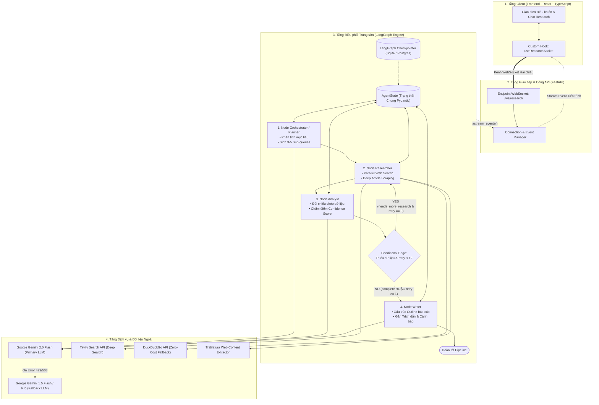
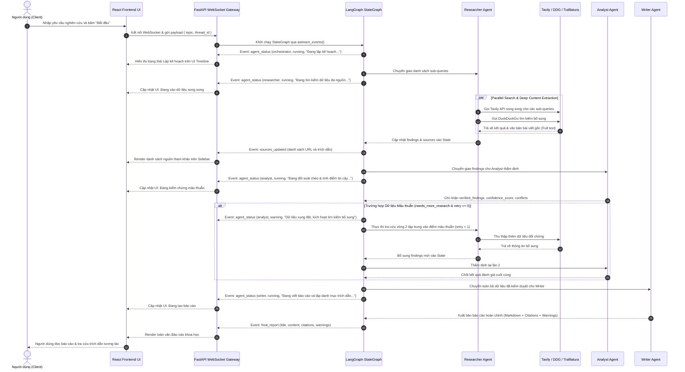

# TÀI LIỆU THIẾT KẾ HỆ THỐNG MULTI-AGENT RESEARCH SYSTEM (MAS)
> **Software Architecture Document (SAD) & Technical Specification**  
> **Trạng thái:** Bản thiết kế kỹ thuật chính thức (Production-Ready Architecture)  
> **Phạm vi:** Hệ thống Multi-Agent AI tự hành thực hiện nghiên cứu chuyên sâu (Deep Research), đối soát chéo dữ liệu (Fact-Checking), tổng hợp báo cáo và truyền phát thời gian thực (Realtime Streaming).

---

## MỤC LỤC
1. [Tổng quan Hệ thống (System Overview)](#1-tổng-quan-hệ-thống-system-overview)
2. [Kiến trúc Tổng thể & Mô hình Điều phối (System Architecture & Graph Topology)](#2-kiến-trúc-tổng-thể--mô-hình-điều-phối-system-architecture--graph-topology)
3. [Đặc tả 4 Agent Chuyên biệt (Specialized Agent Specifications)](#3-đặc-tả-4-agent-chuyên-biệt-specialized-agent-specifications)
4. [Đặc tả State Machine & Điều phối LangGraph (LangGraph Engine)](#4-đặc-tả-state-machine--điều-phối-langgraph-langgraph-engine)
5. [Tầng Công cụ & Tích hợp Dịch vụ Ngoài (Tools & External Integrations)](#5-tầng-công-cụ--tích-hợp-dịch-vụ-ngoài-tools--external-integrations)
6. [Hợp đồng Dữ liệu (Pydantic v2 Data Contracts)](#6-hợp-đồng-dữ-liệu-pydantic-v2-data-contracts)
7. [Giao thức Truyền thông Thời gian thực (WebSocket & Streaming API)](#7-giao-thức-truyền-thông-thời-gian-thực-websocket--streaming-api)
8. [Thiết kế Giao diện Người dùng (Frontend UI/UX Architecture)](#8-thiết-kế-giao-diện-người-dùng-frontend-uiux-architecture)
9. [Cấu trúc Thư mục Toàn dự án (Complete Project Structure)](#9-cấu-trúc-thư-mục-toàn-dự-án-complete-project-structure)
10. [Hạ tầng, Cấu hình Môi trường & Triển khai Docker (DevOps & Deployment)](#10-hạ-tầng-cấu-hình-môi-trường--triển-khai-docker-devops--deployment)
11. [Chiến lược Kiểm thử & Đảm bảo Chất lượng (Testing & QA Strategy)](#11-chiến-lược-kiểm-thử--đảm-bảo-chất-lượng-testing--qa-strategy)

---

## 1. Tổng quan Hệ thống (System Overview)

### 1.1 Tầm nhìn & Mục tiêu (Vision & Objectives)
Hệ thống **Multi-Agent Research System (MAS)** là một nền tảng nghiên cứu thông minh tự hành được phát triển trên kiến trúc Multi-Agent phân tán. Hệ thống giải quyết các bài toán tra cứu phức tạp, yêu cầu đối chiếu từ nhiều nguồn tài liệu trên Internet, kiểm định số liệu khoa học, phát hiện các điểm mâu thuẫn và sinh ra báo cáo chuyên sâu hoàn chỉnh có trích dẫn nguồn gốc xác thực.

### 1.2 Yêu cầu Hệ thống (System Requirements)
* **Chức năng (Functional Requirements)**:
  * Tiếp nhận đề tài nghiên cứu từ người dùng qua giao diện Web.
  * Tự động phân tách đề tài thành các truy vấn con đa chiều (Sub-queries).
  * Thu thập dữ liệu song song qua nhiều công cụ tìm kiếm và cào sâu văn bản bài viết gốc.
  * Thẩm định chéo tính xác thực, phát hiện mâu thuẫn số liệu và tính toán điểm tin cậy (`confidence_score`).
  * Thực hiện vòng lặp phản hồi tra cứu bổ sung có kiểm soát khi thông tin chưa đủ tin cậy.
  * Xuất bản báo cáo chuẩn Markdown có hệ thống đánh số trích dẫn (Footnotes/Citations) và các cảnh báo giới hạn dữ liệu.
  * Truyền phát tiến độ từng bước của các agent theo thời gian thực tới trình duyệt.
* **Phi chức năng (Non-Functional Requirements)**:
  * **Độ trễ tối ưu (Latency Optimization)**: Sử dụng mô hình xử lý bất đồng bộ (`asyncio`) và truy vấn web song song.
  * **Độ bền vững & Chống sập (High Resilience)**: Cơ chế Exponential Backoff Retry với Jitter và Fallback đa tầng (LLM & Search Engine).
  * **Khả năng lưu vết (Persistence & Traceability)**: Quản lý phiên làm việc theo `thread_id` với LangGraph Checkpointer.
  * **An toàn kiểu dữ liệu (Strict Type-Safety)**: Pydantic v2 ở Backend đồng bộ với TypeScript interfaces ở Frontend.

### 1.3 Nguyên tắc Thiết kế Cốt lõi (Core Design Principles)
1. **Phân rã trách nhiệm triệt để (Separation of Concerns)**: Mỗi agent sở hữu một vai trò duy nhất: Lập kế hoạch (`Orchestrator`), Thu thập (`Researcher`), Phản biện (`Analyst`), Hành văn (`Writer`).
2. **Minh chứng 100% (Strict Evidence Grounding)**: Không cho phép xuất bản nhận định số liệu khi chưa có trích đoạn bằng chứng (`evidence`) và URL nguồn xác thực.
3. **Điều hướng phi tập trung (Graph-Driven Routing)**: Không điều phối bằng câu lệnh `if/else` thủ công hoặc các chain cứng; toàn bộ chu trình do đồ thị trạng thái **LangGraph StateGraph** quản lý.

---

## 2. Kiến trúc Tổng thể & Mô hình Điều phối (System Architecture & Graph Topology)

### 2.1 Sơ đồ Phân tầng Hệ thống (System Architecture Diagram)



### 2.2 Sơ đồ Trình tự Thời gian thực (Realtime Sequence Flow)



---

## 3. Đặc tả 4 Agent Chuyên biệt (Specialized Agent Specifications)

### 3.1 Orchestrator / Planner Agent
* **Chức năng**: Tiếp nhận chủ đề nghiên cứu thô từ người dùng, làm rõ phạm vi và phân tích thành **3 đến 5 câu truy vấn con (Sub-queries)** với các góc nhìn bổ trợ nhau:
  1. *Thực trạng và định nghĩa cơ bản*.
  2. *Số liệu thống kê, báo cáo tài chính/thị trường mới nhất*.
  3. *Các tranh luận, phản biện hoặc góc nhìn trái chiều*.
  4. *Xu hướng tương lai hoặc tác động lâu dài*.
* **Input**: `topic: str`, `thread_id: str`.
* **Output**: `ResearchPlan` (chứa danh sách `sub_queries` và `expected_metrics`).
* **Mô hình LLM**: `gemini-2.0-flash` (Structured Output).
* **System Prompt Core**:
  ```text
  Bạn là Trưởng bộ phận Kế hoạch Nghiên cứu (Research Planning Lead).
  Nhiệm vụ của bạn là phân tích đề tài nghiên cứu của người dùng và bóc tách thành 3-5 câu truy vấn tìm kiếm chuyên sâu (sub-queries).
  Yêu cầu:
  1. Các câu truy vấn phải độc lập, bao quát đa chiều (dữ liệu định lượng, bằng chứng thực tế, phản biện).
  2. Sử dụng từ khóa mang tính học thuật, định hướng dữ liệu thực tế (báo cáo, thống kê, phân tích).
  3. Xuất kết quả theo định dạng JSON đúng cấu trúc ResearchPlan.
  ```

### 3.2 Researcher Agent
* **Chức năng**:
  * Tiếp nhận danh sách `sub_queries` từ State.
  * Thực thi tìm kiếm đồng thời qua cơ chế bất đồng bộ `asyncio.gather()` trên cả **Tavily Search API** và **DuckDuckGo**.
  * Chọn lọc top 3 bài viết có độ tương thích cao nhất để cào toàn văn (`full content`) thông qua thư viện `trafilatura`.
  * Trích xuất các sự kiện, số liệu chính xác đính kèm URL nguồn, tiêu đề và ngày xuất bản.
* **Input**: `sub_queries: List[str]`, `follow_up_request: Optional[FollowUpRequest]`.
* **Output**: `ResearcherOutput` (danh sách `findings`, `search_queries`, `limitations`).
* **Công cụ tích hợp**:
  * `TavilyClient`: Tìm kiếm có trích xuất ngữ cảnh RAG.
  * `DuckDuckGoSearchRun`: Tìm kiếm bổ trợ dự phòng.
  * `TrafilaturaReader`: Bóc tách văn bản bài báo loại bỏ mã HTML và quảng cáo thừa.

### 3.3 Analyst Agent
* **Chức năng**:
  * Đóng vai trò là đơn vị kiểm định chất lượng độc lập (Quality Assurance & Fact-Checker).
  * Đối chiếu chéo các tuyên bố (`claims`) giữa các nguồn khác nhau để phát hiện sự chênh lệch số liệu (`conflicts`).
  * Đánh giá mức độ tin cậy của các nguồn báo cáo (trang báo uy tín, cơ quan chính phủ vs blog cá nhân).
  * Tính toán chỉ số tin cậy tổng thể `confidence_score` (`0.0` - `1.0`):
    * `status = "complete"` khi `confidence_score >= 0.75`.
    * `status = "needs_more_research"` khi `confidence_score < 0.75` và phát hiện thiếu số liệu trọng yếu hoặc mâu thuẫn lớn.
* **Input**: `findings: List[Finding]`.
* **Output**: `AnalystOutput` (gồm `confidence_score`, `verified_findings`, `conclusions`, `insights`, `conflicts`, `follow_up_request`).
* **Mô hình LLM**: `gemini-2.0-flash` (Nhiệt độ `temperature=0.1` để tối ưu tư duy phân tích chính xác).

### 3.4 Writer Agent
* **Chức năng**:
  * Tổng hợp toàn bộ các kết luận đã được kiểm chứng (`verified_findings`, `conclusions`, `insights`) thành một tài liệu báo cáo nghiên cứu hoàn chỉnh.
  * Xây dựng hệ thống chú thích nguồn khoa học chuẩn xác (đánh chỉ số `[1]`, `[2]`, ... trong văn bản và lập danh mục trích dẫn cuối bài).
  * **Cơ chế Graceful Degradation**: Nếu pipeline kết thúc trong tình trạng dữ liệu còn hạn chế hoặc có mâu thuẫn chưa giải quyết triệt để (sau 1 lượt retry), Writer có trách nhiệm đặt một mục `⚠️ Cảnh báo & Giới hạn dữ liệu (Warnings)` nổi bật ngay đầu báo cáo.
* **Input**: `analysis: AnalystOutput`, `findings: List[Finding]`.
* **Output**: `WriterOutput` (gồm `title`, `content` định dạng Markdown chuẩn, `citations`, `warnings`).
* **Mô hình LLM**: `gemini-2.0-flash` (hoặc cấu hình fallback sang `gemini-1.5-pro` khi người dùng yêu cầu báo cáo học thuật chuyên sâu).

---

## 4. Đặc tả State Machine & Điều phối LangGraph (LangGraph Engine)

### 4.1 Định nghĩa State chung (LangGraph AgentState)

Toàn bộ thông tin phiên làm việc được lưu giữ trong cấu trúc State duy nhất, truyền qua các node của đồ thị:

```python
# app/graph/state.py
from typing import TypedDict, List, Optional, Dict, Any
from app.schemas.research import (
    ResearchPlan, Finding, AnalystOutput, WriterOutput
)

class AgentState(TypedDict):
    """Trạng thái chia sẻ trung tâm của LangGraph."""
    thread_id: str
    topic: str
    plan: Optional[Dict[str, Any]]
    findings: List[Dict[str, Any]]
    search_queries: List[str]
    analysis: Optional[Dict[str, Any]]
    final_report: Optional[Dict[str, Any]]
    retry_count: int
    errors: List[str]
```

### 4.2 Xây dựng Đồ thị Trạng thái (Graph Construction)

Đồ thị được xây dựng tinh gọn bằng `StateGraph`, loại bỏ toàn bộ các bước gọi LLM trung gian không cần thiết:

```python
# app/graph/build.py
from langgraph.graph import StateGraph, END
from langgraph.checkpoint.sqlite import SqliteSaver
from app.graph.state import AgentState
from app.graph.routing import should_continue_research
from app.agents.orchestrator.agent import run_orchestrator
from app.agents.researcher.agent import run_researcher
from app.agents.analyst.agent import run_analyst
from app.agents.writer.agent import run_writer

def create_research_graph(checkpointer=None):
    workflow = StateGraph(AgentState)

    # 1. Khai báo các Nodes thực thi
    workflow.add_node("orchestrator", run_orchestrator)
    workflow.add_node("researcher", run_researcher)
    workflow.add_node("analyst", run_analyst)
    workflow.add_node("writer", run_writer)

    # 2. Thiết lập điểm khởi đầu và các Edges cố định
    workflow.set_entry_point("orchestrator")
    workflow.add_edge("orchestrator", "researcher")
    workflow.add_edge("researcher", "analyst")

    # 3. Thiết lập Conditional Edge kiểm soát Feedback Loop
    workflow.add_conditional_edges(
        "analyst",
        should_continue_research,
        {
            "researcher": "researcher",  # Quay lại tìm kiếm bổ sung
            "writer": "writer"           # Chuyển tiếp viết báo cáo
        }
    )

    # 4. Node Writer kết thúc trực tiếp luồng
    workflow.add_edge("writer", END)

    return workflow.compile(checkpointer=checkpointer)
```

### 4.3 Logic Điều hướng Có điều kiện (Conditional Routing Guardrail)

Để đảm bảo hệ thống **không bao giờ rơi vào vòng lặp vô hạn (Zero Infinite Loops)** và tối ưu hóa chi phí token:

```python
# app/graph/routing.py
from typing import Literal
from app.graph.state import AgentState

def should_continue_research(state: AgentState) -> Literal["researcher", "writer"]:
    """
    Quyết định nhánh rẽ sau bước Analyst.
    Ràng buộc thép: Chỉ cho phép lặp lại tối đa 1 lần (retry_count < 1).
    """
    analysis = state.get("analysis") or {}
    status = analysis.get("status", "complete")
    retry_count = state.get("retry_count", 0)

    # Nếu phát hiện thiếu dữ liệu VÀ chưa từng retry
    if status == "needs_more_research" and retry_count < 1:
        return "researcher"

    # Mọi trường hợp còn lại đều chuyển tiếp sang Writer
    return "writer"
```

### 4.4 Cơ chế Lưu giữ Trạng thái (Session Checkpointing)
* **SqliteSaver / PostgresSaver**: Mỗi bước chuyển dịch node (`node transition`) được snapshot tự động vào cơ sở dữ liệu checkpointer thông qua cấu hình `configurable={"thread_id": thread_id}`.
* Cho phép khôi phục tức thời trạng thái khi có sự cố đứt kết nối mạng phía người dùng mà không cần chạy lại các bước tốn kém đã hoàn tất.

---

## 5. Tầng Công cụ & Tích hợp Dịch vụ Ngoài (Tools & External Integrations)

### 5.1 LLM Service Layer: Gemini Factory & Tenacity Resilience
Hệ thống sử dụng tầng khởi tạo LLM tập trung kèm cơ chế tự phục hồi lỗi với thuật toán **Exponential Backoff with Jitter**:

```python
# app/tools/llm/factory.py
from langchain_google_genai import ChatGoogleGenerativeAI
from tenacity import retry, stop_after_attempt, wait_random_exponential, retry_if_exception_type
from google.api_core.exceptions import ResourceExhausted, ServiceUnavailable
from app.core.config import settings

class LLMFactory:
    @staticmethod
    def get_primary_model(temperature: float = 0.2):
        return ChatGoogleGenerativeAI(
            model="gemini-2.0-flash",
            google_api_key=settings.GEMINI_API_KEY,
            temperature=temperature,
            timeout=30,
            max_retries=2
        )

    @staticmethod
    def get_fallback_model(temperature: float = 0.2):
        return ChatGoogleGenerativeAI(
            model="gemini-1.5-flash",
            google_api_key=settings.GEMINI_API_KEY,
            temperature=temperature,
            timeout=45
        )

@retry(
    stop=stop_after_attempt(3),
    wait=wait_random_exponential(min=1, max=10),
    retry=retry_if_exception_type((ResourceExhausted, ServiceUnavailable))
)
async def invoke_with_resilience(model, prompt_messages, structured_schema=None):
    """Gọi LLM an toàn chống sập khi dính mã lỗi HTTP 429 hoặc 503."""
    target = model.with_structured_output(structured_schema) if structured_schema else model
    return await target.ainvoke(prompt_messages)
```

### 5.2 Search Layer: Parallel Retrieval & Deduplication
* **Tìm kiếm song song (Async Parallel Execution)**:

```python
# app/tools/search/engine.py
import asyncio
from typing import List, Dict, Any
from tavily import AsyncTavilyClient
from duckduckgo_search import DDGS
from app.core.config import settings

tavily_client = AsyncTavilyClient(api_key=settings.TAVILY_API_KEY)

async def search_tavily(query: str) -> List[Dict[str, Any]]:
    try:
        res = await tavily_client.search(query=query, search_depth="advanced", max_results=3)
        return [{"url": r["url"], "title": r["title"], "content": r["content"]} for r in res.get("results", [])]
    except Exception:
        return []

async def search_duckduckgo(query: str) -> List[Dict[str, Any]]:
    try:
        with DDGS() as ddgs:
            results = list(ddgs.text(query, max_results=3))
            return [{"url": r["href"], "title": r["title"], "content": r["body"]} for r in results]
    except Exception:
        return []

async def parallel_search(queries: List[str]) -> List[Dict[str, Any]]:
    tasks = []
    for q in queries:
        tasks.append(search_tavily(q))
        tasks.append(search_duckduckgo(q))
    
    nested = await asyncio.gather(*tasks, return_exceptions=True)
    flat_results = []
    seen_urls = set()

    for item in nested:
        if isinstance(item, list):
            for doc in item:
                if doc["url"] not in seen_urls:
                    seen_urls.add(doc["url"])
                    flat_results.append(doc)
    return flat_results
```

### 5.3 Deep Web Scraping & Context Management
* Khi phát hiện các bài viết trọng tâm, thư viện `trafilatura` bóc tách văn bản thuần:
```python
# app/tools/scrapers/web_reader.py
import trafilatura

async def extract_clean_article(url: str) -> str:
    """Tải và bóc tách nội dung bài viết gốc, loại bỏ hoàn toàn mã HTML rác."""
    try:
        downloaded = await asyncio.to_thread(trafilatura.fetch_url, url)
        if downloaded:
            text = trafilatura.extract(downloaded, include_comments=False, include_tables=True)
            return text[:4000] if text else ""
    except Exception:
        pass
    return ""
```

---

## 6. Hợp đồng Dữ liệu (Pydantic v2 Data Contracts)

Toàn bộ các thực thể truyền tải giữa các Agent được đặc tả qua Pydantic v2:

```python
# app/schemas/research.py
from pydantic import BaseModel, Field
from typing import List, Optional, Literal

class ResearchPlan(BaseModel):
    topic: str = Field(description="Chủ đề nghiên cứu được chỉ định")
    sub_queries: List[str] = Field(min_length=1, max_length=5, description="Danh sách 3-5 câu hỏi tìm kiếm đa chiều")
    expected_metrics: List[str] = Field(default_factory=list, description="Các chỉ số số liệu cụ thể cần đối soát")

class Finding(BaseModel):
    claim: str = Field(description="Luận điểm hoặc sự kiện trích xuất được")
    evidence: str = Field(description="Đoạn văn trích dẫn nguyên văn làm bằng chứng")
    source_url: str = Field(description="Đường dẫn URL của nguồn dữ liệu")
    source_title: str = Field(description="Tiêu đề bài viết hoặc tên nguồn")
    published_at: Optional[str] = Field(default=None, description="Thời điểm xuất bản bài viết nếu có")

class ResearcherOutput(BaseModel):
    status: Literal["complete", "partial", "failed"]
    findings: List[Finding]
    search_queries: List[str]
    limitations: List[str] = Field(default_factory=list)

class FollowUpRequest(BaseModel):
    questions: List[str] = Field(description="Danh sách câu hỏi cần tra cứu bổ sung")
    preferred_sources: List[str] = Field(default_factory=list, description="Loại nguồn tin cậy cần tập trung tìm kiếm")

class AnalystOutput(BaseModel):
    status: Literal["complete", "needs_more_research"]
    confidence_score: float = Field(ge=0.0, le=1.0, description="Điểm tin cậy từ 0.0 đến 1.0")
    verified_findings: List[Finding]
    conclusions: List[str] = Field(description="Các kết luận chính sau khi thẩm định chéo")
    insights: List[str] = Field(description="Các insight có giá trị rút ra từ dữ liệu")
    conflicts: List[str] = Field(default_factory=list, description="Mâu thuẫn số liệu phát hiện giữa các nguồn")
    limitations: List[str] = Field(default_factory=list)
    follow_up_request: Optional[FollowUpRequest] = None

class Citation(BaseModel):
    id: int = Field(description="Chỉ số trích dẫn trong văn bản [1], [2]...")
    title: str
    url: str
    snippet: str

class WriterOutput(BaseModel):
    status: Literal["complete", "partial"]
    title: str = Field(description="Tiêu đề chuẩn của báo cáo nghiên cứu")
    content: str = Field(description="Nội dung báo cáo chi tiết định dạng Markdown")
    citations: List[Citation]
    warnings: List[str] = Field(default_factory=list, description="Cảnh báo về giới hạn hoặc mâu thuẫn số liệu")
```

---

## 7. Giao thức Truyền thông Thời gian thực (WebSocket & Streaming API)

### 7.1 WebSocket Endpoint Specification
* **Endpoint URL**: `ws://localhost:8000/ws/research`
* **Cơ chế hoạt động**:
  1. Client kết nối và gửi bản tin khởi động kèm `topic` và `thread_id`.
  2. Server đăng ký kết nối vào `ConnectionManager` và kích hoạt hàm stream của LangGraph:
     ```python
     async for event in graph.astream_events(initial_state, config, version="v2"):
         # Bóc tách sự kiện và bắn xuống Client qua WebSocket
     ```

### 7.2 Định dạng Gói tin Sự kiện (WebSocket Stream Payload)

```json
{
  "event_id": "evt_88921",
  "thread_id": "c61b6bb8-1c9f-4318-8f55-14f7b4ee76ad",
  "type": "agent_status",
  "agent": "researcher",
  "status": "running",
  "progress": 45,
  "message": "Đang tìm kiếm song song cho 4 câu hỏi con...",
  "timestamp": "2026-09-19T11:25:00.000Z",
  "payload": {
    "sub_queries_count": 4,
    "current_sources_count": 9
  }
}
```

### 7.3 Bảng Mã Sự kiện Chuẩn (Event Catalog)

| Tên Sự kiện (`type`) | Agent Phát tín hiệu | Mục đích & Ý nghĩa | Payload Đi kèm |
| :--- | :--- | :--- | :--- |
| `connection_ack` | System | Xác nhận kết nối WebSocket thành công | `{ "session_id": "uuid" }` |
| `agent_status` | All Agents | Cập nhật bước xử lý của từng Agent (`running`, `completed`, `warning`) | `{ "progress": 0-100, "message": "..." }` |
| `sources_updated` | Researcher | Cập nhật danh sách URL mới tìm được | `{ "sources": [ { "url", "title" } ] }` |
| `analysis_summary` | Analyst | Tóm tắt điểm tin cậy và mâu thuẫn | `{ "confidence": 0.85, "conflicts": [] }` |
| `final_report` | Writer | Trả toàn bộ báo cáo hoàn chỉnh | `WriterOutput` Object |
| `error` | System | Thông báo lỗi runtime có kiểm soát | `{ "code": 500, "detail": "..." }` |

---

## 8. Thiết kế Giao diện Người dùng (Frontend UI/UX Architecture)

### 8.1 Cấu trúc Component
* **`ResearchInput.tsx`**: Ô nhập chủ đề nghiên cứu, nút khởi chạy và cấu hình tuỳ chọn độ sâu.
* **`AgentTimeline.tsx`**: Thanh tiến trình thể hiện trạng thái 4 Agent (`Orchestrator` -> `Researcher` -> `Analyst` -> `Writer`), hiển thị badge trạng thái động và vòng quay spinner.
* **`SourceViewer.tsx`**: Bảng điều khiển cạnh bên (Drawer / Sidebar) liệt kê các nguồn tin được tham khảo kèm favicon và trích đoạn dẫn chứng.
* **`ConflictWarning.tsx`**: Card cảnh báo màu vàng nổi bật khi hệ thống phát hiện số liệu giữa các nguồn không thống nhất.
* **`MarkdownReport.tsx`**: Trình đọc báo cáo chuẩn Markdown (tích hợp `react-markdown`, `remark-gfm`, `rehype-highlight`), hỗ trợ click vào trích dẫn `[1]` để nhảy đến nguồn tương ứng.

### 8.2 Custom Hook: `useResearchSocket.ts`
Quản lý trạng thái kết nối WebSocket, tự động kết nối lại (Auto-reconnect with Backoff) và lưu cache tin nhắn:

```typescript
// frontend/src/hooks/useResearchSocket.ts
import { useState, useEffect, useRef, useCallback } from 'react';
import { WebSocketMessage, WriterOutput } from '../types/research';

export const useResearchSocket = (threadId: string) => {
  const [isConnected, setIsConnected] = useState(false);
  const [agentStatus, setAgentStatus] = useState<Record<string, any>>({});
  const [sources, setSources] = useState<any[]>([]);
  const [report, setReport] = useState<WriterOutput | null>(null);
  const socketRef = useRef<WebSocket | null>(null);

  const startResearch = useCallback((topic: string) => {
    if (socketRef.current && socketRef.current.readyState === WebSocket.OPEN) {
      socketRef.current.send(JSON.stringify({ topic, thread_id: threadId }));
    }
  }, [threadId]);

  useEffect(() => {
    const ws = new WebSocket(`ws://localhost:8000/ws/research`);
    socketRef.current = ws;

    ws.onopen = () => setIsConnected(true);
    ws.onclose = () => setIsConnected(false);
    ws.onmessage = (event) => {
      const msg: WebSocketMessage = JSON.parse(event.data);
      if (msg.type === 'agent_status') {
        setAgentStatus(prev => ({ ...prev, [msg.agent]: msg }));
      } else if (msg.type === 'sources_updated') {
        setSources(msg.payload.sources);
      } else if (msg.type === 'final_report') {
        setReport(msg.payload);
      }
    };

    return () => ws.close();
  }, [threadId]);

  return { isConnected, startResearch, agentStatus, sources, report };
};
```

---

## 9. Cấu trúc Thư mục Toàn dự án (Complete Project Structure)

```text
multi-agent-research/
├── .gitignore
├── README.md
├── docker-compose.yml              # Dựng đồng thời Frontend, Backend và Checkpointer
│
├── backend/
│   ├── app/
│   │   ├── api/
│   │   │   ├── __init__.py
│   │   │   ├── deps.py             # Dependency injection
│   │   │   └── websocket.py        # WebSocket router /ws/research
│   │   │
│   │   ├── agents/
│   │   │   ├── __init__.py
│   │   │   ├── base.py             # BaseAgent class trừu tượng
│   │   │   ├── orchestrator/       # Planner Agent
│   │   │   │   ├── agent.py
│   │   │   │   └── prompts.py
│   │   │   ├── researcher/         # Parallel Research Agent
│   │   │   │   ├── agent.py
│   │   │   │   └── prompts.py
│   │   │   ├── analyst/            # Fact-Checking & Conflict Detection Agent
│   │   │   │   ├── agent.py
│   │   │   │   └── prompts.py
│   │   │   └── writer/             # Report & Citation Synthesis Agent
│   │   │       ├── agent.py
│   │   │       └── prompts.py
│   │   │
│   │   ├── graph/
│   │   │   ├── __init__.py
│   │   │   ├── state.py            # TypedDict AgentState
│   │   │   ├── build.py            # StateGraph builder
│   │   │   └── routing.py          # Conditional Edges & loop guardrail
│   │   │
│   │   ├── tools/
│   │   │   ├── __init__.py
│   │   │   ├── search/
│   │   │   │   ├── engine.py       # Async Parallel search engine
│   │   │   │   ├── tavily_tool.py
│   │   │   │   └── ddg_tool.py
│   │   │   ├── scrapers/
│   │   │   │   └── web_reader.py   # Trafilatura full content extractor
│   │   │   └── llm/
│   │   │       └── factory.py      # Gemini factory + Tenacity resilience
│   │   │
│   │   ├── services/
│   │   │   ├── __init__.py
│   │   │   ├── research_service.py # Stream events service
│   │   │   └── connection_mgr.py   # WebSocket active connections
│   │   │
│   │   ├── schemas/
│   │   │   ├── __init__.py
│   │   │   ├── research.py         # Pydantic v2 data models
│   │   │   └── websocket.py        # WebSocket event payloads
│   │   │
│   │   ├── core/
│   │   │   ├── __init__.py
│   │   │   ├── config.py           # BaseSettings (.env loading)
│   │   │   └── logging.py          # Loguru structured logging
│   │   │
│   │   └── main.py                 # FastAPI application entry point
│   │
│   ├── tests/
│   │   ├── test_agents.py          # Unit test từng agent
│   │   ├── test_graph.py           # Integration test luồng đồ thị
│   │   └── test_tools.py           # Test search & scraper tools
│   │
│   ├── Dockerfile
│   ├── requirements.txt
│   ├── .env.example
│   └── .env
│
└── frontend/
    ├── src/
    │   ├── components/
    │   │   ├── research/
    │   │   │   ├── ResearchInput.tsx
    │   │   │   ├── AgentTimeline.tsx
    │   │   │   ├── SourceViewer.tsx
    │   │   │   ├── ConflictWarning.tsx
    │   │   │   └── MarkdownReport.tsx
    │   │   └── ui/
    │   │       ├── Button.tsx
    │   │       ├── Card.tsx
    │   │       ├── Badge.tsx
    │   │       └── Spinner.tsx
    │   │
    │   ├── hooks/
    │   │   └── useResearchSocket.ts
    │   │
    │   ├── types/
    │   │   └── research.ts
    │   │
    │   ├── App.tsx
    │   ├── main.tsx
    │   └── index.css
    │
    ├── package.json
    ├── tsconfig.json
    ├── vite.config.ts
    ├── tailwind.config.js
    └── Dockerfile
```

---

## 10. Hạ tầng, Cấu hình Môi trường & Triển khai Docker (DevOps & Deployment)

### 10.1 Cấu hình Biến môi trường (`backend/.env.example`)

```env
# AI Model Configuration
GEMINI_API_KEY=AIzaSyYourGoogleAIStudioKeyHere
PRIMARY_LLM_MODEL=gemini-2.0-flash
FALLBACK_LLM_MODEL=gemini-1.5-flash

# Search Engine Configuration
TAVILY_API_KEY=tvly-YourTavilyApiKeyHere

# System Settings
ENVIRONMENT=production
LOG_LEVEL=INFO
CHECKPOINT_DB_PATH=./storage/checkpoints.db
ALLOWED_ORIGINS=http://localhost:3000,http://localhost:5173
```

### 10.2 Tệp Cấu hình `docker-compose.yml`

```yaml
version: '3.8'

services:
  backend:
    build:
      context: ./backend
      dockerfile: Dockerfile
    container_name: mas_backend
    restart: always
    ports:
      - "8000:8000"
    environment:
      - GEMINI_API_KEY=${GEMINI_API_KEY}
      - TAVILY_API_KEY=${TAVILY_API_KEY}
      - ENVIRONMENT=production
    volumes:
      - checkpoint_data:/app/storage
    healthcheck:
      test: ["CMD", "curl", "-f", "http://localhost:8000/docs"]
      interval: 30s
      timeout: 10s
      retries: 3

  frontend:
    build:
      context: ./frontend
      dockerfile: Dockerfile
    container_name: mas_frontend
    restart: always
    ports:
      - "3000:80"
    depends_on:
      - backend

volumes:
  checkpoint_data:
    driver: local
```

---

## 11. Chiến lược Kiểm thử & Đảm bảo Chất lượng (Testing & QA Strategy)

### 11.1 Các Tầng Kiểm thử
1. **Unit Testing (Pytest)**:
   * Kiểm thử tính tương thích schema của từng Agent thông qua việc giả lập (Mock) LLM response.
   * Xác thực hàm routing `should_continue_research` với các giá trị biên (`retry_count = 0`, `retry_count = 1`).
2. **Integration Testing**:
   * Kiểm thử luồng tích hợp StateGraph với `SqliteSaver`.
   * Kiểm tra khả năng tự động kích hoạt DuckDuckGo khi Tavily bị giả lập lỗi mạng.
3. **End-to-End WebSocket Testing**:
   * Kiểm thử kết nối WebSocket, tính đúng đắn của chuỗi sự kiện được phát đi từ khi gửi `topic` đến khi nhận `final_report`.

### 11.2 Ma trận Kịch bản Kiểm thử Nghiệm thu (Acceptance Test Matrix)

| Mã Kịch bản | Tên Kịch bản | Dữ liệu Đầu vào | Tiêu chí Nghiệm thu Thành công |
| :--- | :--- | :--- | :--- |
| **ATM-01** | Tuyến tính Chuẩn (Standard Path) | "Báo cáo tiến trình phát triển xe điện toàn cầu năm 2025" | • Graph chạy tuần tự 4 node.<br>• `retry_count = 0`.<br>• Báo cáo Markdown có tối thiểu 4 citations hợp lệ.<br>• Hoàn thành trong < 25 giây. |
| **ATM-02** | Xử lý Mâu thuẫn (Feedback Loop) | "So sánh các ước tính trái chiều về tăng trưởng GDP một quốc gia" | • Analyst phát hiện mâu thuẫn số liệu (`conflicts` có dữ liệu).<br>• Graph tự động quay lại Researcher 1 lần.<br>• `retry_count = 1`.<br>• Báo cáo phản ánh rõ ràng 2 luồng quan điểm. |
| **ATM-03** | Ràng buộc Chống lặp (Loop Safety) | "Một sự kiện giả định không hề tồn tại trên Internet" | • Không tìm thấy tài liệu xác thực.<br>• Graph dừng quay vòng sau lần retry thứ nhất.<br>• Báo cáo được tạo ra đính kèm danh mục `warnings` rõ ràng. |
| **ATM-04** | Chịu lỗi Rate Limit (Fault Tolerance) | Giả lập mã lỗi HTTP 429 từ Gemini API | • Cơ chế Tenacity tự động retry sau 2s, 4s.<br>• Graph không bị sập (No unhandled exception).<br>• Báo cáo cuối cùng hoàn tất thành công. |
| **ATM-05** | Khôi phục Phiên (Session Resilience) | Đóng trình duyệt đột ngột khi Researcher đang chạy | • StateGraph tiếp tục chạy trên Server và ghi checkpoint.<br>• Mở lại phiên với cùng `thread_id`, nhận ngay kết quả trọn vẹn. |

---
*Bản thiết kế kỹ thuật này là tài liệu chuẩn mực duy nhất định hướng quá trình xây dựng mã nguồn và triển khai thực tế hệ thống Multi-Agent Research System.*
